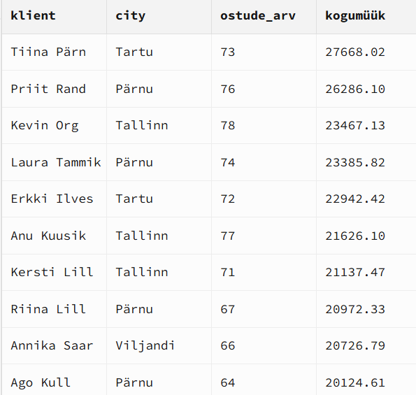
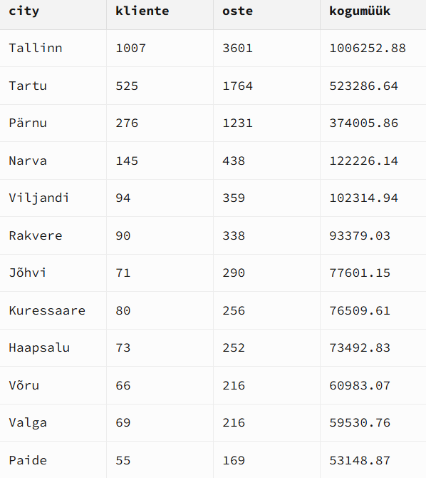
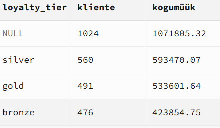

## SQL JOIN analüüs: müük, linnad ja lojaalsus

## Ärikontekst

Selle projekti eesmärk oli uurida, kuidas müük jaguneb klientide, linnade ja loyalty tasemete vahel. Analüüs aitab ettevõttel paremini mõista, millised kliendid toovad kõige rohkem käivet, millised linnad on kõige olulisemad turud ning kas lojaalsusprogramm jõuab väärtuslike klientideni.

Kasutasin SQL JOIN-e, et ühendada klientide, ostude ja lojaalsustasemete andmed üheks analüüsiks.
Uurisin, kes on TOP kliendid ja kuidas müük jaguneb linnade ja loyalty tasemete vahel. Selgus, et Tallinn on kõige suurem turg ning seal toimub kõige rohkem oste ja käivet. Samuti on näha, et väike hulk kliente toob suure osa kogumüügist. Üllatav oli see, et kõige rohkem müüki tuleb klientidelt, kellel puudub loyalty tier. See viitab sellele, et lojaalsusprogramm ei pruugi praegu kõige väärtuslikumaid kliente hästi kaasata.

## Tulemused

### TOP 10 kliendid kogumüügi järgi


### Müük linnade kaupa


### Müük loyalty taseme järgi


## Key Insights

1. Tallinn on kõige suurem turg — seal on 1007 klienti, 3601 ostu ja üle 1 miljoni kogumüüki.
2. TOP klientide hulgas on esindatud mitu linna, mitte ainult Tallinn. See näitab, et väärtuslikke kliente leidub ka Tartus ja Pärnus.
3. Kõige suurem kogumüük tuleb klientidelt, kellel puudub loyalty tier. See võib tähendada, et lojaalsusprogramm ei kaasa hetkel kõiki väärtuslikke kliente.
4. Silver ja gold taseme kliendid toovad samuti suure osa müügist, kuid nende kogumüük jääb alla NULL grupile.
5. Pärnu paistab silma tugeva müügiga võrreldes klientide arvuga.


## Technologies Used

- SQL
- JOIN (INNER JOIN, LEFT JOIN)
- Aggregation (COUNT, SUM)
- GROUP BY
- ORDER BY
- Git & GitHub

## Conclusion

See projekt näitab SQL JOIN päringute praktilist kasutamist äriandmete analüüsimisel. Analüüsi abil oli võimalik tuvastada kõige väärtuslikumad kliendid, võrrelda linnade müügitulemusi ning hinnata lojaalsusprogrammi mõju müügile.

## How to Run

1. Laadi repo alla:

```bash
git clone https://github.com/sandrasalmanis/daca-portfolio.git
