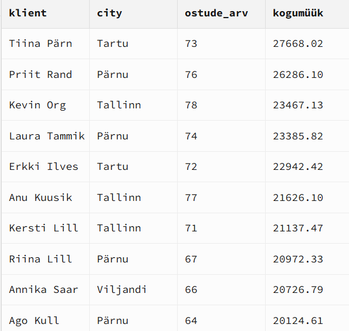
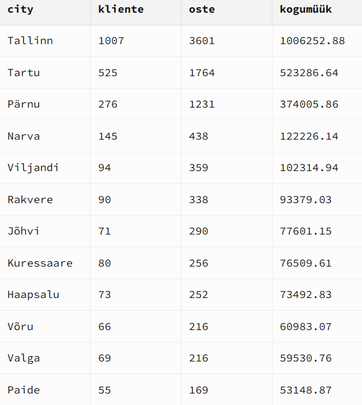

## Minu JOIN-analüüs
Uurisin, kes on TOP kliendid ja kuidas müük jaguneb linnade ja loyalty tasemete vahel. Selgus, et Tallinn on kõige suurem turg ning seal toimub kõige rohkem oste ja käivet. Samuti on näha, et väike hulk kliente toob suure osa kogumüügist. Üllatav oli see, et kõige rohkem müüki tuleb klientidelt, kellel puudub loyalty tier. See viitab sellele, et lojaalsusprogramm ei pruugi praegu kõige väärtuslikumaid kliente hästi kaasata.

## Tulemused

### TOP kliendid

### Müük linnade kaupa

### Müük loyalty järgi

